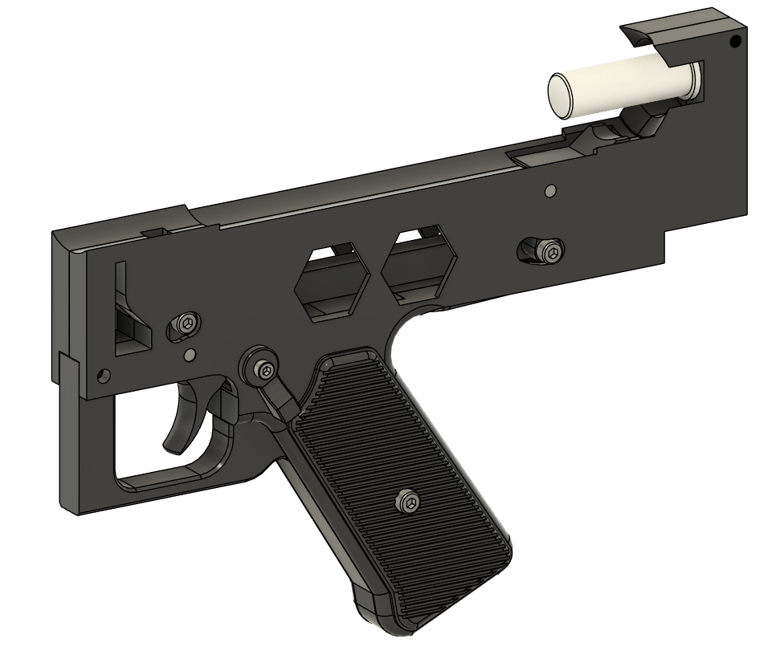
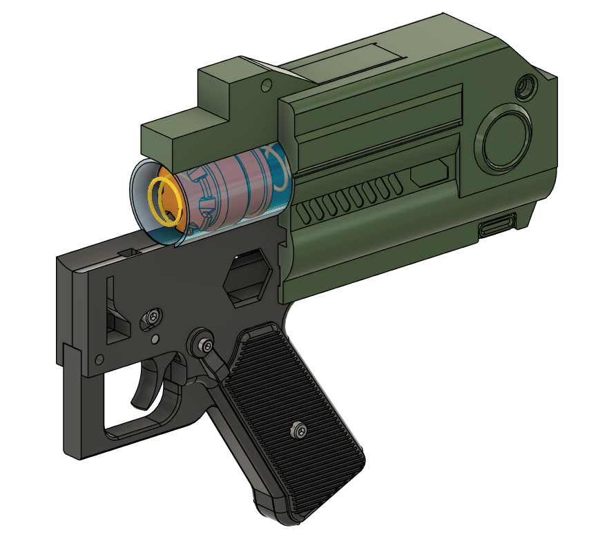
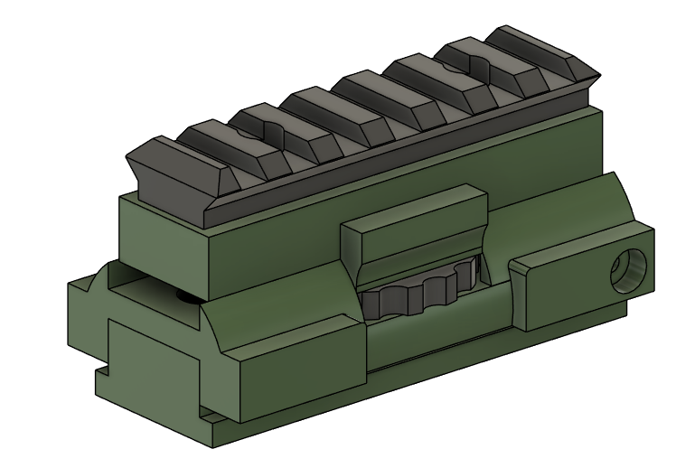
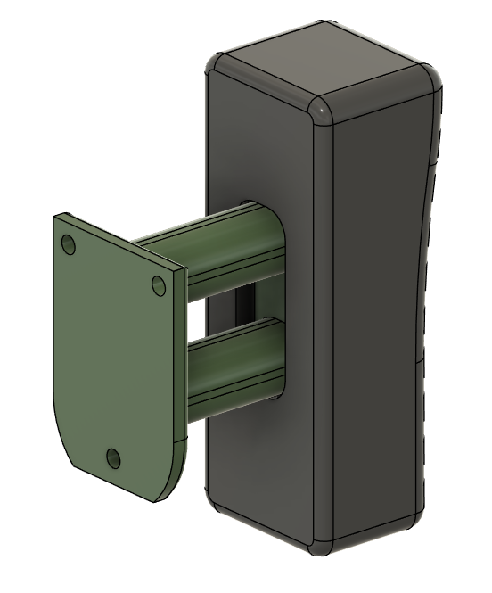

# Assembly Guide

## Parts

 [Assembling the Trigger Group](triggergroup.md).

 [Assembling the Rear Internals](rearinternals.md).

 [Optional: Assembling the Optics Rail](opticsrail.md).

 [Assembling the Receiver](receiver.md).

 [Assembling the Front Barrel Shroud](barrelshroud.md).

 [Assembling the Stock](stock.md).