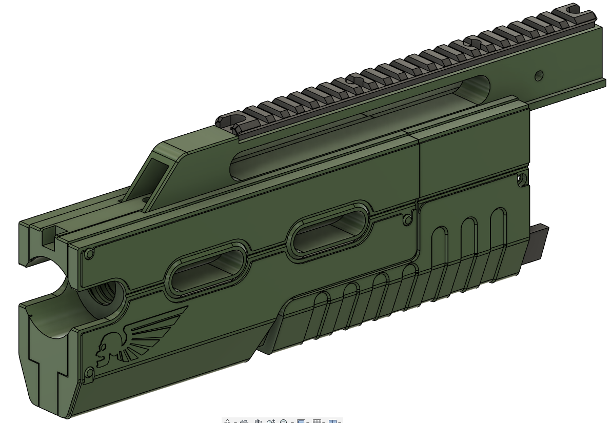

# Assembling the Front Barrel Shroud

## Recommended Print Orientations
### 3 Walls , 10% infill

### 4 Walls , 15% infill

## Tools
- 3.0mm Hex driver / Key

## Hardware
2x M4 heatset insert
1x M4x16 socket head bolt
1x M4x12 socket head bolt
6x M4x8 socket head bolt

## Assembly

Fit two M4 Heatset inserts in the 'Upper Rail' part

Slide the 'Barrel Shroud Front' part into the upper rail and fix with an M4x16 bolt.

Slide the Fore Grip into place and secure with an M4x12 bolt

Attach the Rail with four M4x8 bolts.

Slide the completed assembly onto the front of the blaster, and secure with two m4x8 bolts.
