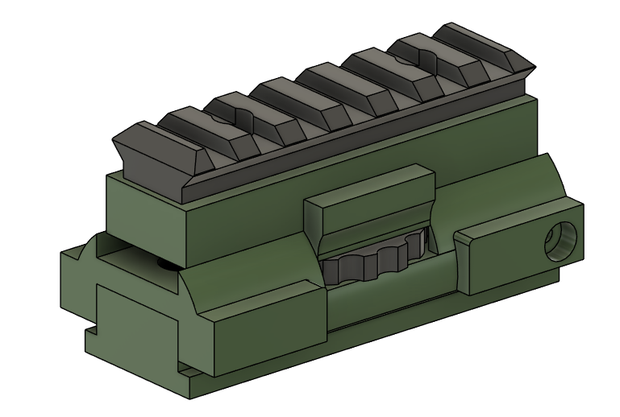
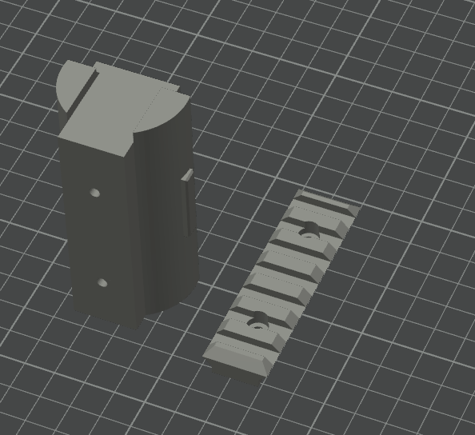
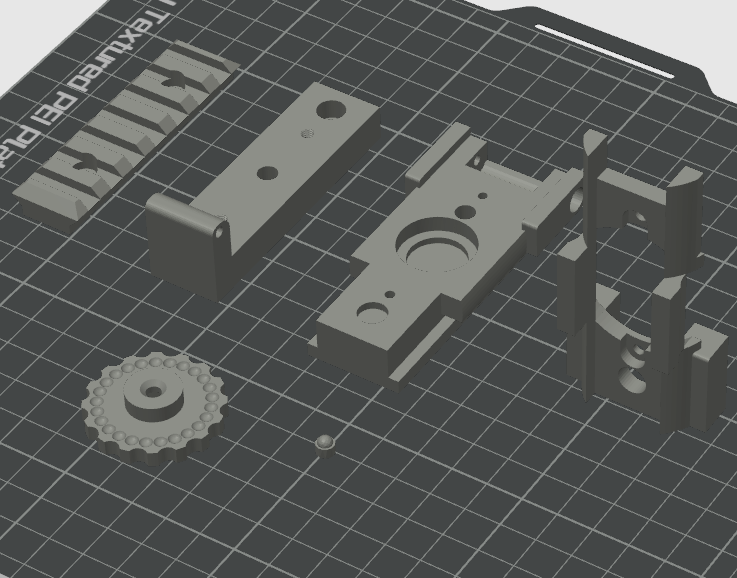
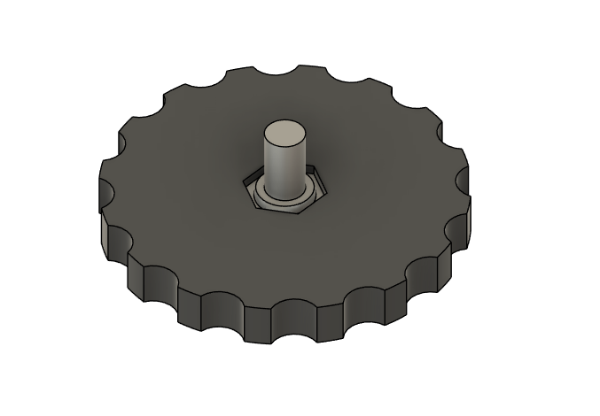
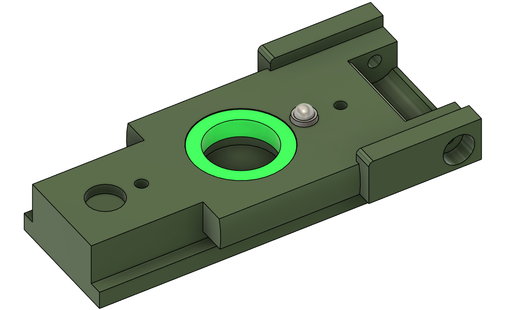
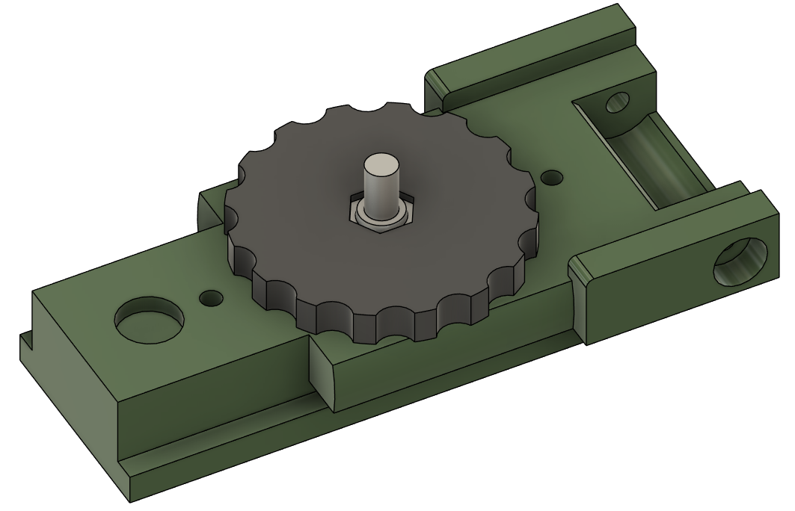
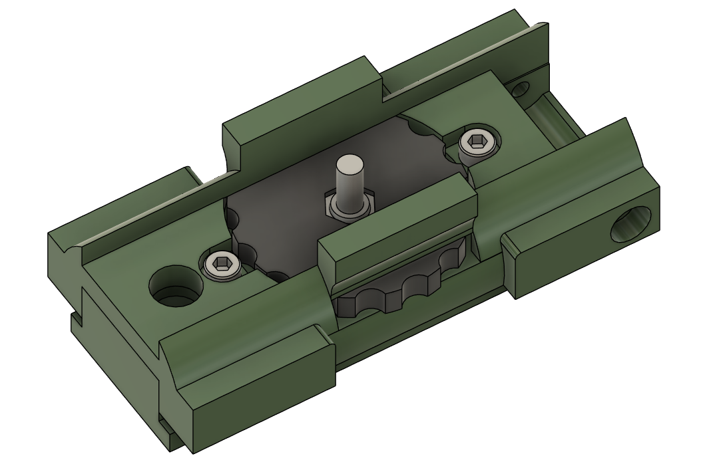
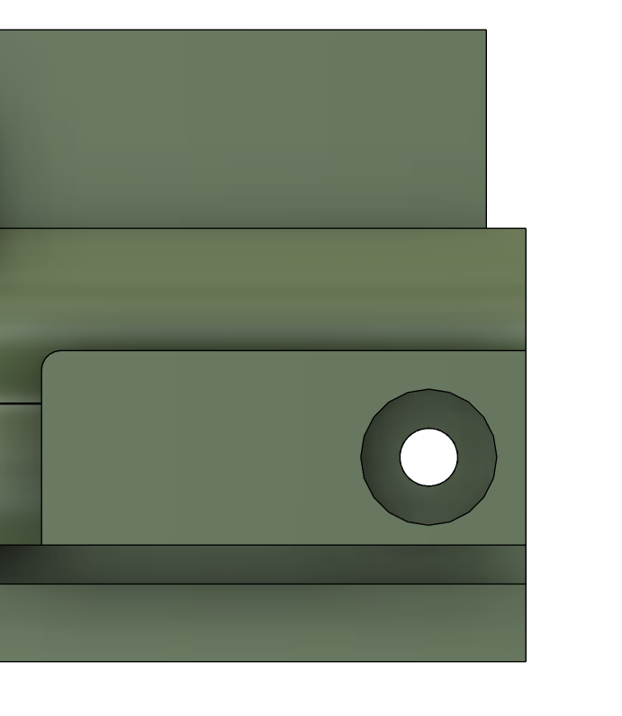
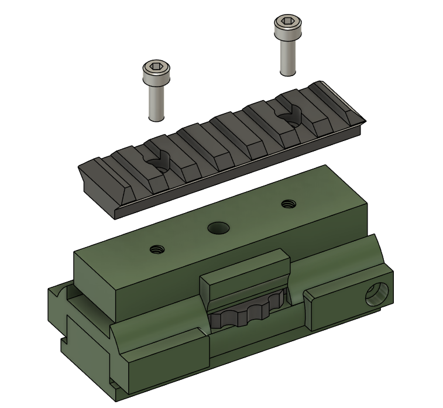

# Assembling the Optics Rail

This is an optional step. When using optics there is not enough vertical control on some Optics to compensate for the short range and drop of darts. This rail allows for more vertical adjustment. If you don't plan on using Optics then you can print the solid part.

## Recommended Print Orientations

## Option 1 - Solid Optics Rail
### 3 Walls , 10% infill, No Supports needed

## Option 2 - Adjustable Optics Rail
### 3 Walls , 10% infill, Tree Supports needed

## Tools
- 3.0mm Hex driver / Key
- 2.5mm Hex driver / Key

## Hardware

Common
- 2x M4x10 Socket Head Bolt

Option 2
- 1x 6702ZZ Bearing
- 1x 5mm x 12mm spring
- 1x 7mm x 20mm spring
- 4x M3 x 12mm Socket Head Bolt
- 1x M4 x 16mm Countersunk Screw
- 1x M4 Locknut
- 1x M4 Heatset Insert
- 2x M4 x 12mm Socket Head Bolt

## Assembly

If you are building the solid version of the optics mount, then skip to the last step.

Set a M4 heatset insert into the Optics Mount Top 

Build the Thumb Wheel
Push the M4 Locknut into the hexagonal hole in the thumbwheel.
From the other side screw the M4 countersunk screw through the thumbwheel.

Take the Optics Mount Lower, and press the 6702ZZ bearing into place.\
Insert the 5x12mm spring into the smaller hole, and place the locator carefully on top of the spring.

Carefully lower the thumbwheel into the bearing in the Optics Mount Lower, taking care to not dislodge the locator.

Fit the Optics Mount Upper over the assembled parts. Again take care to ensure the wheel stays in place and the locator is not dislodged.
Use to M3x12 bolts to secure the Optics Mount Upper.

Place the 7 x 20 Spring in the larger hole, then take the Optics Mount Top and use the thumb wheel to screw into the heatset insert in the Mount Top. 

Turn the thumb Wheel untill the side holes at the rear line up.

Once the holes are lined up, screw in an M3x12mm bolt either side, once the screw is tight, back off half a turn to ensure movement.

Screw the Optics Rail into the Optics Mount Top with two M4x12 bolts. 

