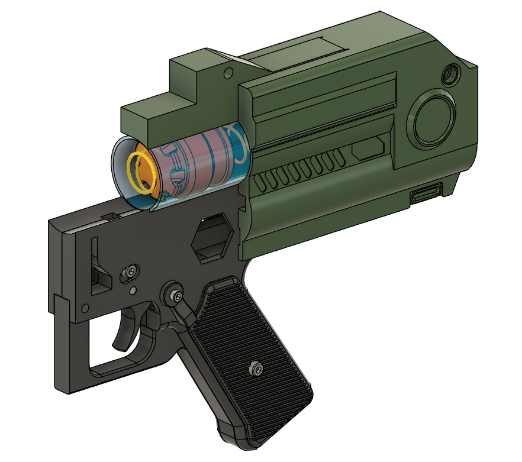
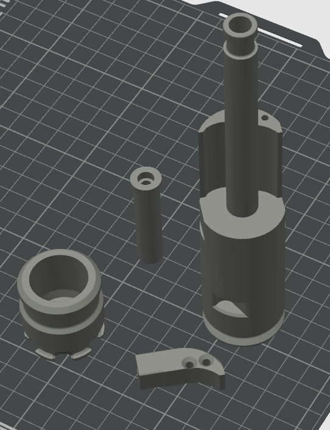
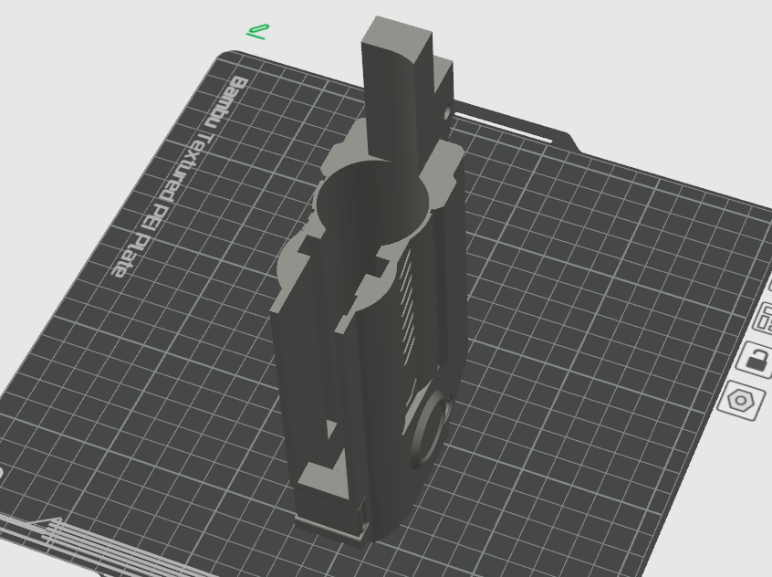
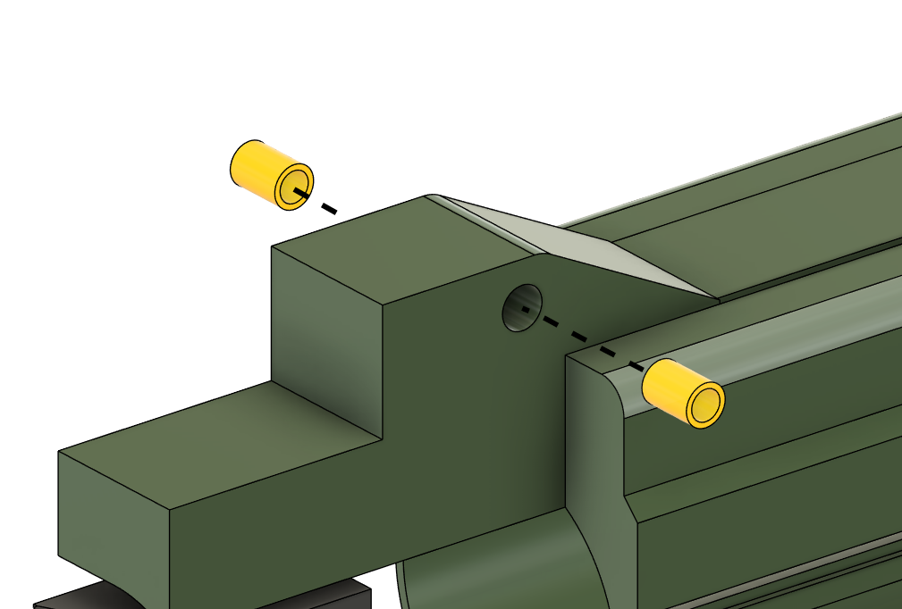
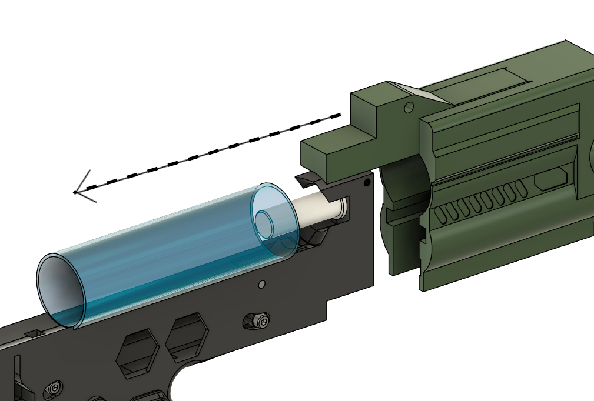
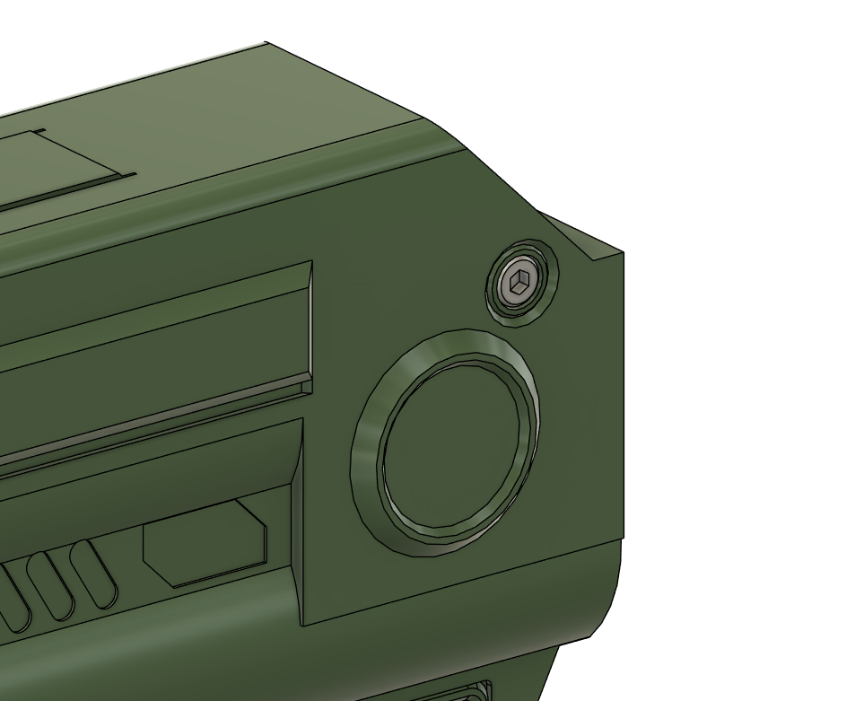

# Assembling the Rear Internals

## Recommended Print Orientations

### 4 Walls , 15% infill, Tree Support On
BoltSlide OnePiece, Piston, BoltCollar, Charging Handle\

### 3 Walls , 10% infill, No Supports needed

## Tools
- 3.0mm Hex driver / Key

## Hardware

- 2x M4 Heatset Inserts
- 1x 130mm Aluminium Plunger tube
- 2x M4x12 Socket Head Bolts
- 1x Silicone Oil (1000ct)

## Assembly

Put aside the BoltSlide OnePiece, BoltCollar and Charging Handle, these will be fitted in a later step

Set the heat inserts into the RearShell as shown\

Ensure the edges of the plunger tube are free of any burrs from cutting and file any burrs away is needed.\
Very Important. Carefully clean the inside of the plunger tube, make sure it is entirely free of any aluminium shavings or particles from cutting/filing.\
Put three or four small drops of 1000ct Silicone Oil into the inside of the plunger tube, and wipe it through to ensure that all of the interior surface of the plunger tube is thinly coated.

Place the plunger tube onto the Trigger Group

And slide the RearShell over the plunger tube 

Screw in two M4x12 bolts into the rear shell
