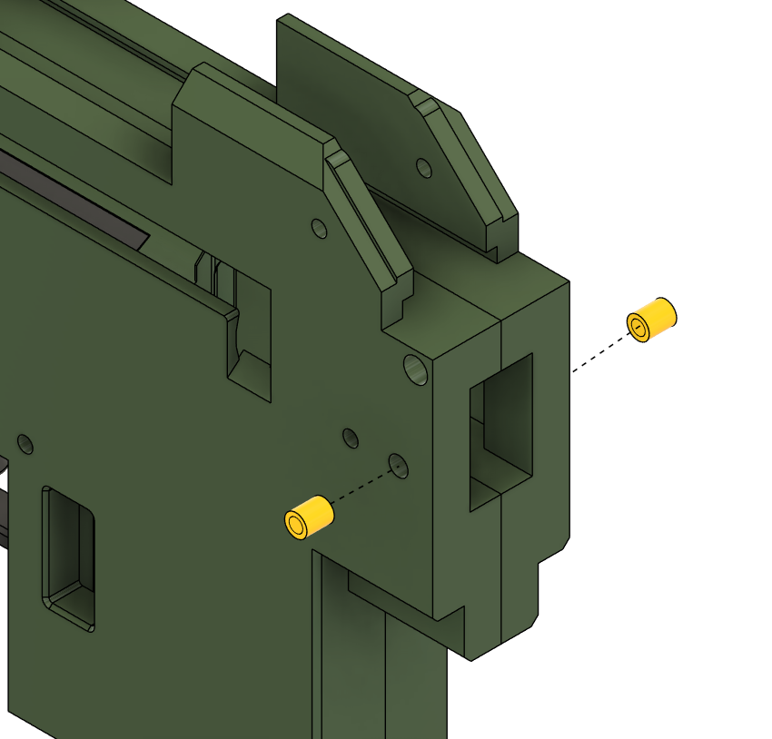
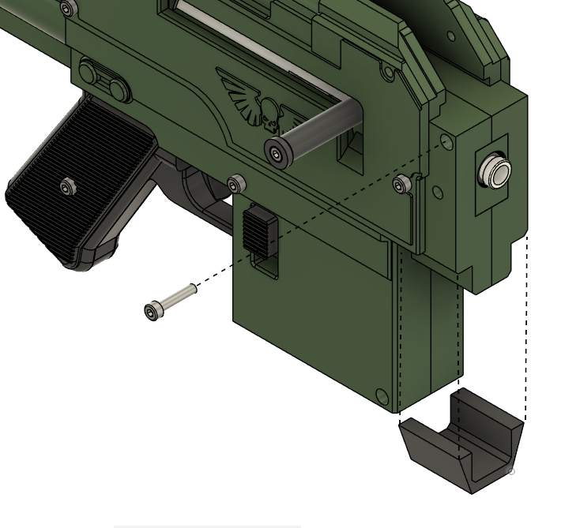

# Assembling the Receiver for Double Stacked Magazines

## Parts and Recommended Print Orientations

If you are planning to use a threaded Worker barrel then its recommended that you print
- Feed Ramp Insert Worker Threaded

If you are using an unthreaded aluiminium barrel then its recommended you print
- Feed Ramp Insert Smooth

This guide assumes the threaded insert is being used, but the instructions are the same regardless.

### 3 Walls , 10% infill

### 4 Walls , 15% infill

## Tools
- 2.0mm Hex Driver / Key
- 2.5mm Hex driver / Key
- 3.0mm Hex driver / Key

## Hardware
2x M4 Heatset inserts
3x 2.62mm Section 29.82mm Bore NITRILE 70 Shore Rubber O-Rings 
2x 1.5mm Section 10mm Bore NITRILE 70 Shore Rubber O-Rings
1x 1000ct Silicone Oil
1x M4x60 Socket head bolt
5x M4x20 Socket head bolt
2x M4x8 Socket head bolt
2x M4x12 Socket head bolt
2x 7x20mm spring
1x M3x12 Socket head bolt

## Assembly

Fit the M4 heatset inserts into the front end of of each of the receiver halves.

Place two 29.8mm bore o-rings over the piston. On the outer o-ring clip it over three of the protrusions on the front of the piston as shown.
Put a small amount of silicone oil over the piston o-rings.

Insert the D12580 spring (or equivalent) into the plunger tube, and place the piston over the spring.

Take part 'BoltSlide OnePiece' and place a 29.8mm bore O-ring into the rear groove, take two of the smaller 10mm bore o-rings and fit them into the front groove. 
Put a couple of drops of Silicone oil over the O-Ring at the back, and O-Rings at the front, wipe off any excess.

Take the part 'BoltCollar' and two M3 x 16mm countersunk screws, and screw the BoltCollar into the 'BoltSlide OnePiece' 

Take the 'Charging Handle' and an M4x60 bolt, and screw both into the BoltCollar to complete the Bolt Slide.

Take the Rear Assembly, the completed bolt slide and 'Reciever RHS Double'\
Use the Bolt Slide to compress the piston down into the pluger tube and press the bolt slide into the plunger tube.\
Take care to ensure the bolt slides O-Ring fits properly and is not pinched by the edge of the plunger tube.\
At this point do not push the bolt slide to far down the plunger tube, just past the O-Ring as shown below is fine.

Holding the bolt slide in place, take the 'Reciever RHS Double' and slide it into place into the odd shaped hole in the grip.

Once 'Reciever RHS Double' is in place you can gently release the Bolt slide and settle it into the side of the reciever, the Bolt Slide will rest naturally on its stops.

Next we will secure the Grip section to the Right hand side of the receiver.
Take 'SidePanel RHS' and a M4x20 screw and screw both into the hole shown below, taking care to not dislodge the Bolt Slide while doing so.
Screw an additional M4x20 into the Rear Shell, and an M4x8 into the receiver as shown.

 
Slide the Feed Ramp Insert (either Worker threaded or Smooth depending on which barrel you intend to use) into place and secure with an M4x12 bolt.\
(Tip: if using the threaded barrel, check that the barrel screws smoothly into the threaded version of the Freed Ramp Insert before fitting, if its stiff or squeaks, a drop of Silicone Oil can help)

Installing the mag release.
Take the 'Mag Release Internal' part and 'MagReleaseBarDouble' place these together into the receiver.
(Note the orientation of the MagReleaseBarDouble part in the picture.

Fit the MagReleaseDouble part along with the second 7x20mm spring.

Press the Optics Mount into place.

Close the Receiver by fitting the 'Reciever LHS Double', to make it easier to fit, rotate the charging handle to the up position.

Screw in the 'SidePanel LHS' using two M4x20, one M4x8 screw and M4x12.

Clip the Grip Connector to the front underside of the Receiver, and Screw in an M4x20 bolt to complete the receiver.
