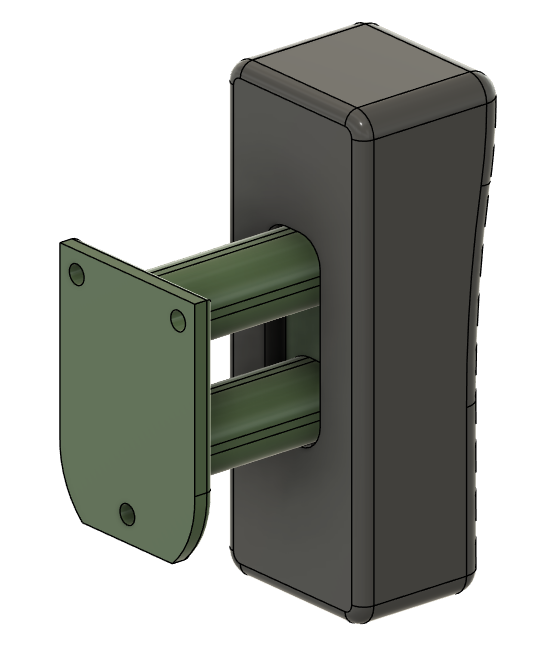
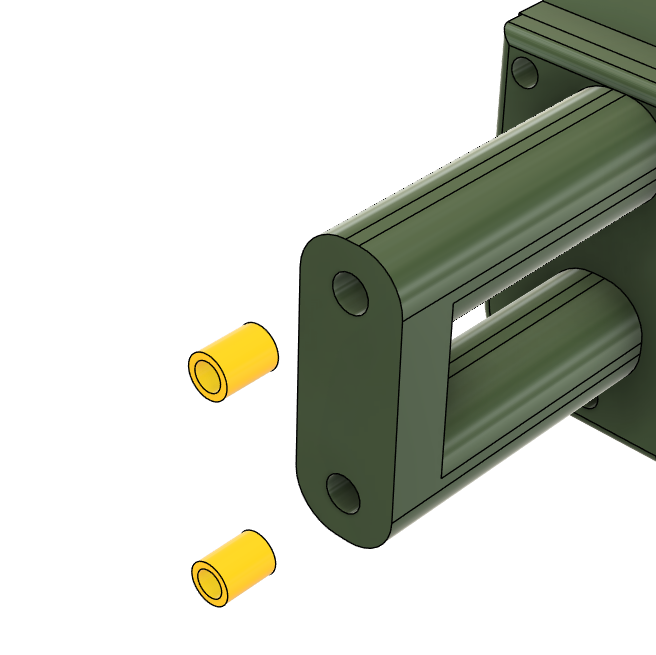
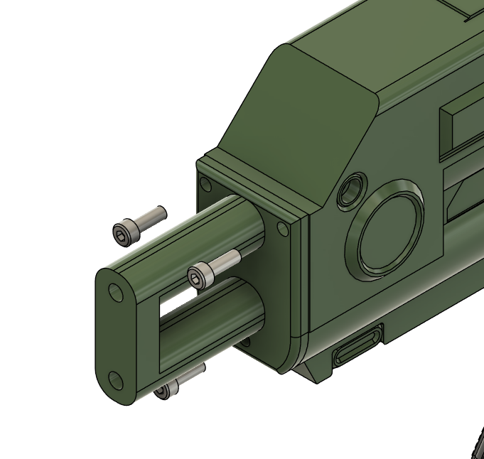
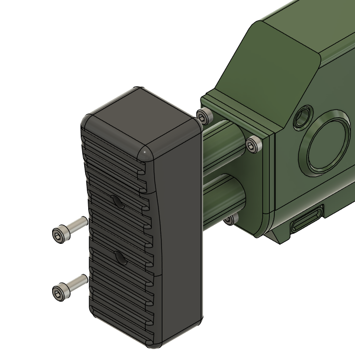
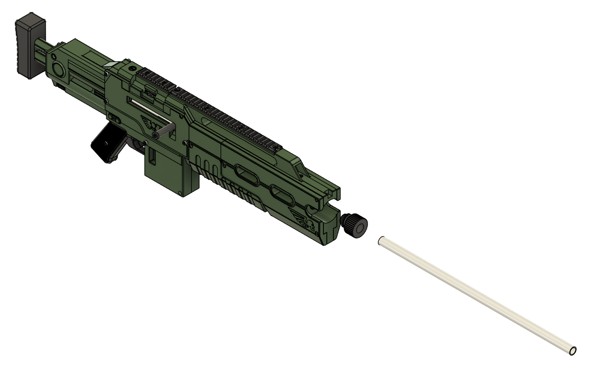

# Finishing up.
## Adding the Stock and fitting the barrel

## Recommended Print Orientations
### 3 Walls , 10% infill

### 4 Walls , 15% infill

## Tools
- 3.0mm Hex driver / Key

## Hardware
5x M4x16 Socket Head bolt
2x Heatset Insert

## Assembly

Fit the heat set inserts

Attach the Stock part with three M4x16 bolts.

Attach the Stock Pad with two M4x16 bolts.

Slide the 450mm Barrel into place (and screw in if using the worker barrel) Secure with the Muzzle nut.

And thats it.\
Slap in a mag, and test the whole thing.\
Best of Luck!