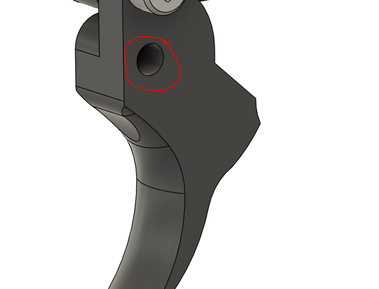

# Trigger Group

## Suggested Print Orientations

## Tools
- 2.5mm Hex driver / Key
- 3.0mm Hex driver / Key
- 3.0mm Drill bit

## Hardware

- 2x Springs
- 1x M4 x 12 Socket Head bolt
- 1x M4 x 16 Socket Head bolt

Build the trigger mechanism, first take the trigger and use a 3mm drill bit and carefully drill the pivot hole, this is printed undersize, and then drilled out to ensure a more exact fit.

Next take the Trigger, Transfer Bar and the Sear, use an M4x12 to connect the trigger to the transfer bar, and an M4x16 the transfer bar to the Sear as shown below.

