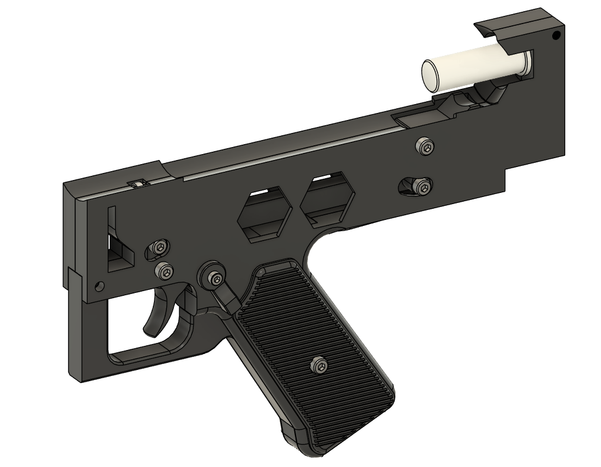

# Aseembling the Trigger Group

## Recommended Print Orientations
### 3 Walls , 10% infill

### 4 Walls , 15% infill

## Tools
- 2.5mm Hex driver / Key
- 3.0mm Hex driver / Key
- 3.0mm Drill bit

## Hardware

- 2x Springs
- 1x M4 x 12 Socket Head bolt
- 1x M4 x 16 Socket Head bolt
- 1x M3 x 20 Socket Head bolt
- 2x M4 x 20 Socket Head bolt
- 2x M4 x 10 Socket Head bolt

Build the trigger mechanism, first take the trigger and use a 3mm drill bit and carefully drill the pivot hole, this is printed undersize, and then drilled out to ensure a more exact fit.

Next take the Trigger, Transfer Bar and the Sear, use an M4x12 to connect the trigger to the transfer bar, and an M4x16 the transfer bar to the Sear as shown below.

Next install the Safety Switch into the Fire Group Frame Left. Take the Safety switch and slide it into the frame, in the down / safe position.

Flip the frame over and fit the Safety Cam to the Safety switch exactly as shown below. This is a bit fiddly, but the parts will slide together.
Then screw an M3x20 into the Safety Switch and through into the Safety Cam.
This part should be stiff to move, but still move reasonably freely.

Next take the Fire Group Frame Right, and fit two M4x20 bolts as shown below. Don't worry about taking these out while fitting the Trigger Assembly.

Place a 7x20mm spring inside the box cut out in the Transfer bar. This spring fits onto this little box. This is a little tricky, and you might need to remove the M4 bolts while doing this.

As soon as the Trigger Assembly is on the detent, then make sure the two M4x20 mm bolts are put into place. Then fit the Sear Spring (7x20mm spring) into the Sear at the rear.

Fit the Grip Frame and Spring Holder into the Fire Group Frame Right.

Finally clamp the Fire Group Frame Left and Right together.

 
Fit the Grips (use the locator pins to stop them from rotating) and use an M4x10mm screw to attach them. (do not overtighten these screws)
Optional : Use low Profile screws, or dome screws for improved comfort.

