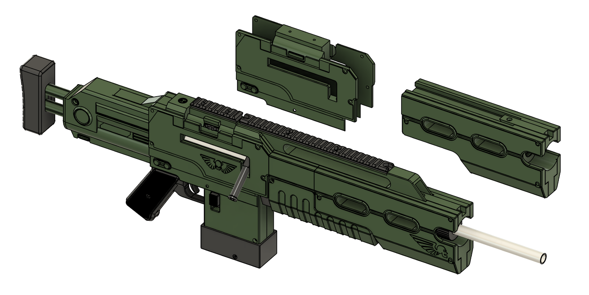

# Bolt Sniper

## Description

Bolt Action Sniper rifle inspired by the Warhammer 40k Guards Sniper rifle.

## BOM (WIP)
- 1x - D12580 Spring - Springmasters \
	https://www.springmasters.com/shop/d12580/ 
- 4x - D11310 Spring - Springmasters \
	https://www.springmasters.com/shop/d11310/  
- 1x - 450mm Worker barrel - UK Nerfwar \
	https://www.uknerfwar.com/product-page/450mm-barrel
- 1x - 130mm Aluminium tube 38.1mm OD, 34.9mm ID - Use a supplier with a custom cutting service e.g: \
    https://www.metals4u.co.uk/materials/aluminium/aluminium-tube/986-p \
    https://www.aluminium-online.co.uk/product/1-1-4-x-16swg-aluminium-round-tube/
	
- 3x - O-Ring -  2.62mm Section 29.82mm Bore NITRILE 70 Shore Rubber O-Rings - Simply bearings
- 2x - O-Ring - 	1.5mm Section 10mm Bore NITRILE 70 Shore Rubber O-Rings
- M4 Screws (todo)
- M3 Screws (todo)
- 2x - M4 grub screw (M4 x 8mm)

## Attribution
- Moose Deuce Double Stack Magazines - Misplaced Moose \
	https://www.printables.com/model/1402880-double-stack-half-dart-nerf-magazines-aka-moose-du
- Cynthia - Barrel Nut and Piston front - Sillybuts \
	https://github.com/Sillybutts/Cynthia?tab=readme-ov-file

## These files are provided free of charge
However if you like these files then please consider supporting me. \
You can donate via my BuyMeACoffee, this helps pay for materials I use while prototyping. Thank you.

## Licence
Creative Commons, Attribution-NonCommercial-ShareAlike 4.0 International \
CC BY-NC-SA 4.0 \
https://creativecommons.org/licenses/by-nc-sa/4.0/deed.en